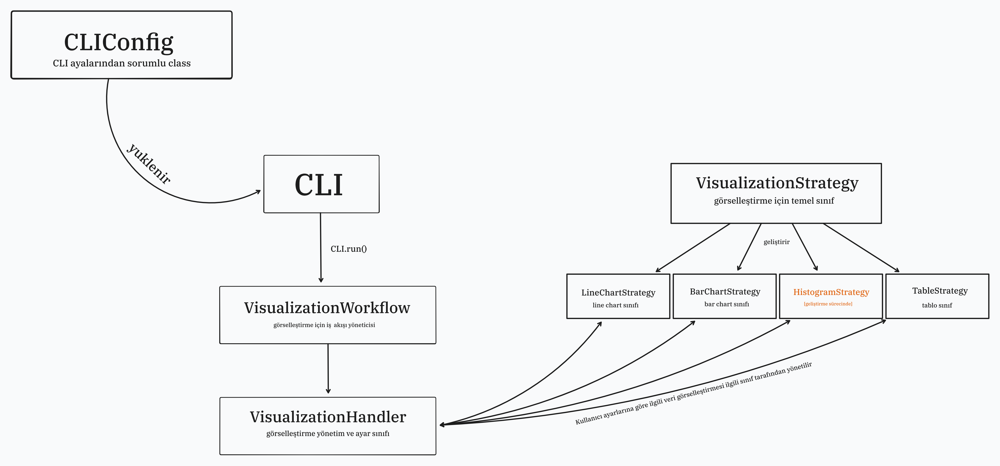

# Visualize

Visualize, çeşitli veri dosyalarından interaktif grafik oluşturmanıza olanak sağlayan güçlü bir Python komut satırı aracıdır.

## 📊 Özellikler

- **Çoklu Format Desteği**: CSV, Excel (XLSX/XLS), JSON ve TXT dosyaları
- **İnteraktif Görselleştirme**: Çizgi, çubuk grafikleri, histogram ve tablo görüntüleme
- **Çoklu Dosya İşleme**: Birden fazla dosyayı aynı anda işleme ve karşılaştırma
- **Kullanıcı Dostu CLI**: InquirerPy tabanlı modern komut satırı arayüzü
- **Esnek Çıktı**: Ekranda gösterme veya yüksek çözünürlüklü PNG kaydetme

## 📖 Dokümantasyon

Detaylı kullanım kılavuzu, API referansı ve örnekler için dokümantasyonu ziyaret edin:

**🔗 [Tam Dokümantasyon](https://riqoto.github.io/visualize/)**

Dokümantasyon içeriği:
- 📊 **Genel Bakış**: Özellikler ve desteklenen formatlar
- ⚙️ **Kurulum**: Adım adım kurulum talimatları
- 🚀 **Hızlı Başlangıç**: İlk grafiğinizi 2 dakikada oluşturun
- 📝 **Kullanım Örnekleri**: Gerçek dünya senaryoları
- 🔧 **API Referansı**: Tüm modüllerin detaylı dokümantasyonu
- 🛠️ **Sorun Giderme**: Yaygın sorunlar ve çözümleri


## 🚀 Hızlı Başlangıç

### Kurulum

1.  Sanal ortam oluşturun:

    ```bash
    python3 -m venv .venv
    source .venv/bin/activate
    ```

2.  Bağımlılıkları yükleyin:

    ```bash
    pip install -r requirments.txt
    ```

3.  **Opsiyonel** - GUI backend (grafikleri ekranda görüntülemek için):

    **Linux (Debian/Ubuntu):**
    ```bash
    sudo apt install python3-tk
    ```

    **Linux (Fedora/RHEL):**
    ```bash
    sudo dnf install python3-tkinter
    ```

    **Linux (Arch):**
    ```bash
    sudo pacman -S tk
    ```

    **macOS:**
    ```bash
    brew install python-tk
    ```

    **Windows:**
    Tk genellikle Python ile birlikte gelir. Eğer sorun yaşarsanız Python'u yeniden kurun.

    **Alternatif (Tüm Platformlar):**
    ```bash
    pip install PyQt5
    ```

### Kullanım

```bash
python -m visualize.main
```

Program size interaktif olarak:
- Dosya seçimi
- Görselleştirme modu (tek, çoklu, karşılaştırma)
- Grafik türü
- Eksen ve kolon seçimi

seçeneklerini sunacaktır.

## 📁 Desteklenen Dosya Formatları

- **CSV** (`.csv`) - Virgülle ayrılmış değerler
- **Excel** (`.xlsx`, `.xls`) - Microsoft Excel dosyaları
- **JSON** (`.json`) - JavaScript Object Notation
- **TXT** (`.txt`) - Metin dosyaları (otomatik delimiter tespiti)

## 🎨 Görselleştirme Tipleri

- **Line Chart** - Zaman serisi ve trend analizi
- **Bar Chart** - Kategorik veri karşılaştırmaları
- **Histogram** - Dağılım analizi
- **Table** - Veri tablo görüntüleme

## 🏗️ Mimari



## 📚 Gereksinimler

- Python 3.10+
- Matplotlib
- Pandas
- InquirerPy

## 🔗 Linkler

- [GitHub Repository](https://github.com/riqoto/visual)
